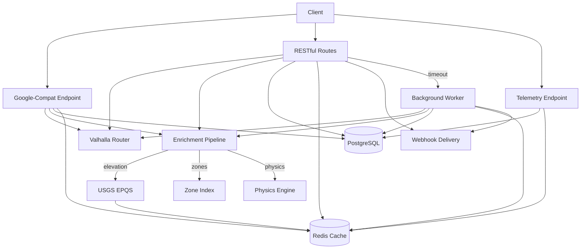

## Architecture

Motion is a freight routing API built for hackathon speed and production-grade design. It wraps the open-source [Valhalla](https://github.com/valhalla/valhalla) routing engine and layers on physics-based enrichment computed from real USGS elevation data and road geometry.



## Tech Stack

| Layer | Technology | Purpose |
|-------|-----------|---------|
| **Framework** | [FastAPI](https://fastapi.tiangolo.com/) | Async Python web framework with automatic OpenAPI generation |
| **Routing Engine** | [Valhalla](https://github.com/valhalla/valhalla) | Open-source turn-by-turn routing with truck costing model |
| **Database** | [PostgreSQL](https://www.postgresql.org/) + [asyncpg](https://github.com/MagicStack/asyncpg) | Route persistence, events, zone polygons |
| **Cache** | [Redis](https://redis.io/) | Request deduplication, route caching, idempotency keys |
| **Elevation** | [USGS EPQS](https://epqs.nationalmap.gov/) | Real elevation data for grade computation |
| **Migrations** | [Alembic](https://alembic.sqlalchemy.org/) | Database schema migrations |
| **Validation** | [Pydantic v2](https://docs.pydantic.dev/) | Request/response schema validation |
| **Containerization** | [Docker Compose](https://docs.docker.com/compose/) | One-command setup for all services |

## Key Design Decisions

<AccordionGroup>
  <Accordion title="Why two API styles?" icon="code-branch">
    **Google-compatible** (`/directions/v2:computeRoutes`) lets teams migrate from Google Routes API by changing only the base URL. **RESTful routes** (`/v1/routes`) adds statefulness, async processing, and webhooks for production use cases. Both hit the same enrichment pipeline.
  </Accordion>
  <Accordion title="Why this resource design?" icon="cube">
    We adopted industry best practices: ULID-prefixed IDs (`route_`), an `object` field on every resource, idempotency keys, consistent error envelopes, and a processing/complete/failed state machine.
  </Accordion>
  <Accordion title="Why physics enrichment?" icon="flask">
    Google Routes API tells you distance and duration - but not road grade, curvature, or fuel consumption. For a 36-ton semi on a 6% grade, fuel burn can be 3× higher than flat road. Motion fills that gap using real elevation models and road-load physics equations.
  </Accordion>
  <Accordion title="Why cursor-based pagination?" icon="arrow-right">
    Telemetry segments can number in the hundreds. We use cursor-based pagination with `hasMore`/`nextCursor` for predictable performance. Offset pagination would be fragile for large segment lists.
  </Accordion>
</AccordionGroup>

## Local Development

<Info>
  **Prerequisites**: Docker and Docker Compose installed.
</Info>

<Steps>
<Step title="Clone and start">

```bash
git clone https://github.com/r-thak/motion.git
cd motion
docker compose up -d
```

This starts PostgreSQL, Redis, Valhalla, and the Motion API on port 8000.
</Step>

<Step title="Verify">

```bash
curl http://localhost:8000/health
# {"status": "ok"}
```
</Step>

<Step title="Run without Docker (optional)">

```bash
cd api
pip install -e .
python dev_server.py --real
```

Requires PostgreSQL and Redis running separately.
</Step>
</Steps>

## Running Tests

```bash
cd api
python test_runner.py
```
